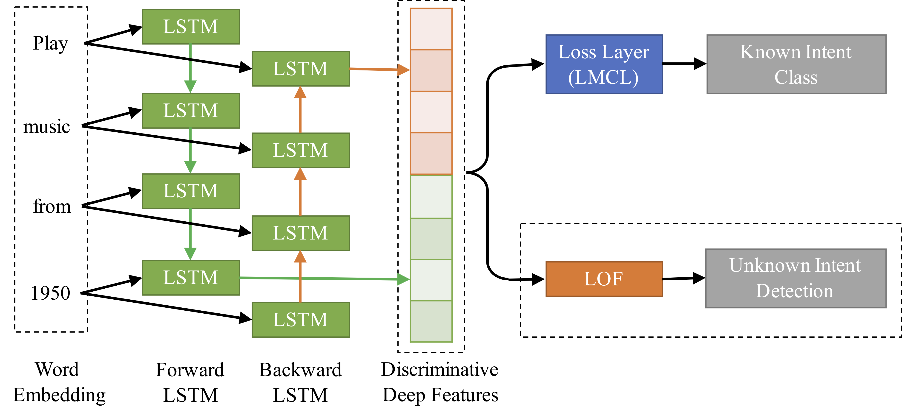

# Deep Unknown Intent Detection with Margin Loss
Implementation of the research paper [Deep Unknown Intent Detection with Margin Loss (ACL2019)](https://aclweb.org/anthology/papers/P/P19/P19-1548/) 

Identifying the unknown (novel) user intents that have never appeared in the training set is a challenging task in the dialogue system. In this paper, we present a two-stage method for detecting unknown intents. We use `bidirectional long short-term memory (BiLSTM)` network with the `margin loss` as the feature extractor. 

With margin loss, we can learn discriminative deep features by forcing the network to maximize inter-class variance and to minimize intra-class variance. Then, we feed the feature vectors to the density-based novelty detection algorithm, `local outlier factor (LOF)`, to detect unknown intents.

The architecture of the proposed method:




## Usage

1. Install all required library
```
pip install -r requirements.txt
```

2. Get the GloVe embedding and modify the `embedding_path` in `experiment.py/ipynb`
```
wget http://nlp.stanford.edu/data/glove.6B.zip
unzip glove.6B.zip
```

3. Run the experiments by: 
```
python experiment.py <dataset> <proportion>
python experiment.py SNIPS 50
python experiment.py ATIS 25
```

## Result
| % of known intents | 25% | 50% | 75% | 25% | 50% | 75%
:---------------------|:----:|:----:|:----:|:----:|:----:|------:  
|                     | SNIPS|      |      | ATIS |      |      | 
| MSP                 |  -   | 6.2  | 8.3  | 8.1  | 15.3 | 17.2 
| DOC                 | 72.5 | 67.9 | 63.9 | 61.6 | 62.8 | 37.7 
| DOC (Softmax)       | 72.8 | 65.7 | 61.8 | 63.6 | 63.3 | 38.7 
| LOF (Softmax)       | 76.0 | 69.4 | 65.8 | 67.3 | 61.8 | 38.9 
| LOF (LMCL)          | __79.2__ | __84.1__ | __78.8__ | __69.6__ | __63.4__ | __39.6__ 


## Citation
If you mentioned the method in your research, please cite this article:
```
@inproceedings{lin-xu-2019-deep,
    title = "Deep Unknown Intent Detection with Margin Loss",
    author = "Lin, Ting-En  and
      Xu, Hua",
    booktitle = "Proceedings of the 57th Annual Meeting of the Association for Computational Linguistics",
    month = jul,
    year = "2019",
    address = "Florence, Italy",
    publisher = "Association for Computational Linguistics",
    url = "https://www.aclweb.org/anthology/P19-1548",
    pages = "5491--5496",
}
```
